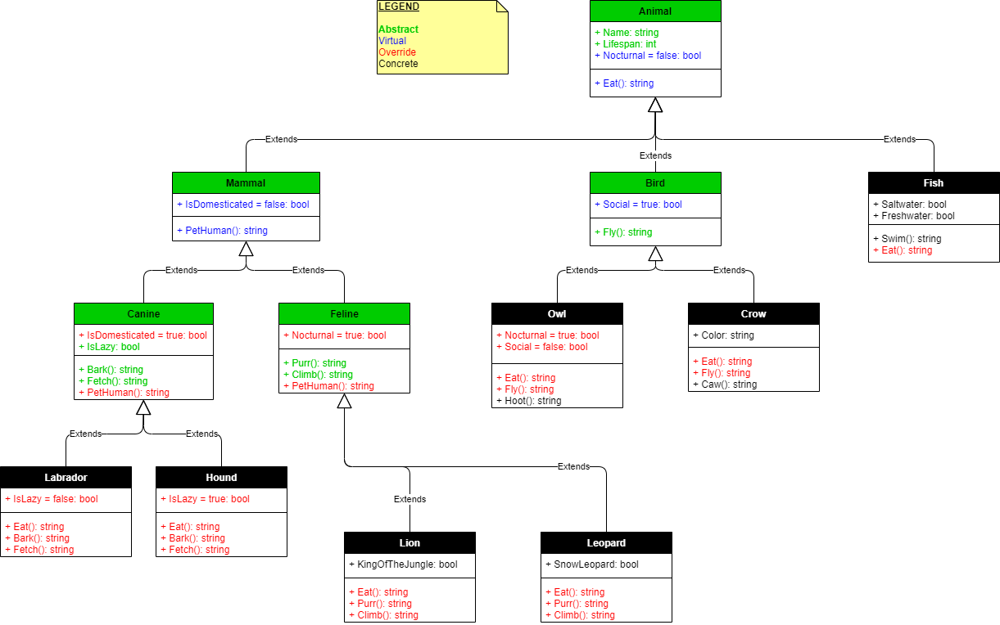
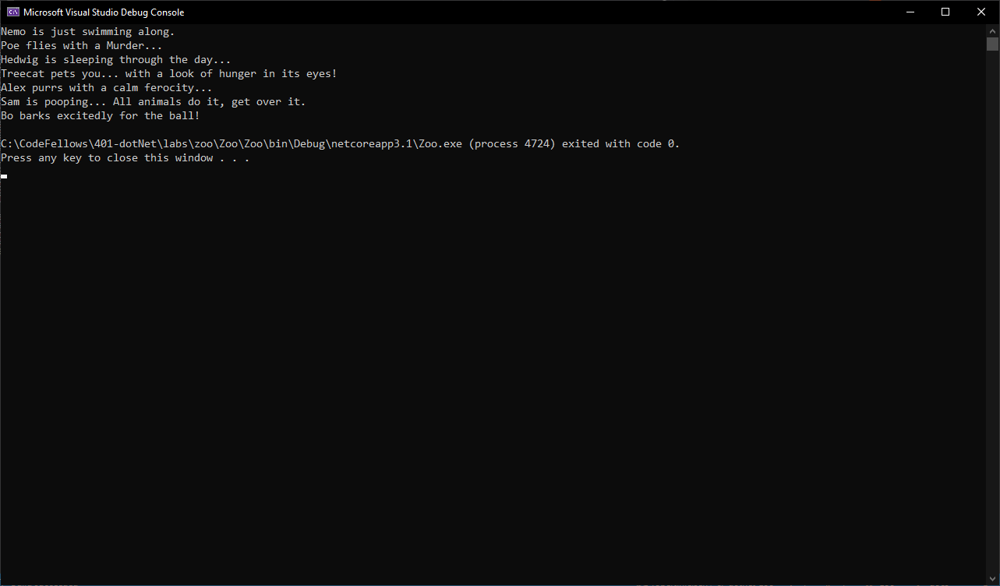

# OOP Zoo

Code Fellows 401 .NET Course  
Lab 06: OOP Principals & Lab 07: Interfaces  
_Author: [Robert James Nielsen](https://github.com/robertjnielsen)_

## Overview

This is a C# / .NET Core console application to help learn the fundamentals of the four OOP principals, as well as Interfaces.

This application is a simple Zoo app. It has a base class of Animal, as well as several derived classes from there. Different classes make use of abstraction and polymorphism in a variety of ways.

## Getting Started

#### Clone This Repository

To clone this repository, navigate to a directory you would like to clone it down to within your preferred command prompt / terminal. Then enter the following:

`$ git clone https://github.com/robertjnielsen/cf-dotnet-zoo.git`

#### Run This Application With Visual Studio

Select `File` -> `Open` -> `Project / Solution`

Next, navigate to where you cloned the repository.

Double click on the `Zoo` directory.

Then select and open `Zoo.sln`.

Once the solution has loaded, press `Ctrl + F5` on your keyboard, or `Debug` -> `Start Without Debugging`.

## Visuals

#### Class Structure UML

#### Screen Capture Of Zoo Running

## Change Log

**1.4** - 20200329
- Documentation completed to current version.

**1.3** - 20200329
- Tests completed.

**1.2** - 20200329
- Interfaces created / completed.
- Classes completed.

**1.1** - 20200325
- Documentation started.
- Classes created.

**1.0** - 20200325
- Project / solution files created.
- Repository created / initialzed.
- UML diagram created.